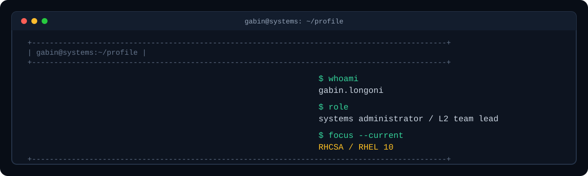

<div align="center">
  
</div>

<p align="center">
  <a href="https://github.com/Opperiesen">
    
  </a>
  <a href="https://www.linkedin.com/in/gabinlongoni/">
    
  </a>
  <a href="https://github.com/Opperiesen/Branch">
    
  </a>
  <a href="https://github.com/Opperiesen/opperiesen-pages">
    
  </a>
</p>

<p align="center">
  <samp>Systems Administrator · L2 Team Lead · RHCSA / RHEL 10 learner</samp>
</p>

<br />

## Hello, I’m Gabin 👋

I work at the intersection of infrastructure, support and operational discipline. As a **Systems Administrator and L2 Team Lead at Deloitte Luxembourg**, I focus on making technology easier to operate: clearer support paths, reliable diagnosis and practical documentation.

```text
observe  →  understand  →  automate  →  document  →  improve
```

My current learning focus is the **RHCSA on RHEL 10**. I train through a structured lab programme built around repetition, troubleshooting and proof: make the change, verify the state, reboot when it matters, and document what happened.

## Current focus - RHCSA / RHEL 10

The current track covers the fundamentals that make a Linux administrator dependable in production:

- shell, files, permissions, users, groups, `sudo`, RPM and DNF;
- processes, `systemd`, journals, scheduling and time synchronisation;
- NetworkManager, SSH, `firewalld`, storage, LVM, XFS, swap and `/etc/fstab`;
- NFS, `autofs`, SELinux, boot recovery and multi-layer troubleshooting.

The goal is not to collect commands: it is to build a repeatable diagnostic method and be able to prove that a system remains correct after a reboot.

## What I work on

<table>
  <tr>
    <td width="33%" valign="top">
      <h3>🧭 Reliability & support</h3>
      <p>L2 troubleshooting, incident analysis, escalation paths, knowledge transfer and runbooks that help teams operate with confidence.</p>
    </td>
    <td width="33%" valign="top">
      <h3>🐧 RHEL administration</h3>
      <p>Linux fundamentals, service lifecycle, networking, storage, access control, SELinux and recovery under pressure.</p>
    </td>
    <td width="33%" valign="top">
      <h3>🧪 Lab discipline</h3>
      <p>Reproducible exercises, deliberate failure, evidence after reboot and documentation that another administrator can follow.</p>
    </td>
  </tr>
</table>

## Selected projects

<table>
  <tr>
    <td width="50%" valign="top">
      <h3><a href="https://github.com/Opperiesen/Branch">Branch</a></h3>
      <p>A native macOS Git workspace designed to make the graph, changes, diff and recovery state easier to understand.</p>
      <p>
        
        
        
      </p>
    </td>
    <td width="50%" valign="top">
      <h3><a href="https://github.com/Opperiesen/EmuOS">EmuOS</a></h3>
      <p>A polished retro game launcher for Android, built around a console-like, controller-first experience.</p>
      <p>
        
        
      </p>
    </td>
  </tr>
  <tr>
    <td width="50%" valign="top">
      <h3><a href="https://github.com/Opperiesen/opperiesen-pages">Notes & experiments</a></h3>
      <p>A Hugo-based space for technical learnings, projects, reflections, recommendations and reproducible experiments.</p>
      <p>
        
        
      </p>
    </td>
    <td width="50%" valign="top">
      <h3>📚 RHCSA / RHEL 10</h3>
      <p>Current learning track: a local-first programme of 24 courses, 26 labs and exam simulations for the EX200 objectives.</p>
      <p>
        
        
      </p>
    </td>
  </tr>
</table>

## Toolbox

<p>
  
  
  
  
  
  
  
  
  
  
  
</p>

## GitHub snapshot

<p align="center">
  
  
  
  
</p>

<p align="center">
  <sub>Live indicators from GitHub and Shields · my contribution graph is available directly on the profile overview.</sub>
</p>

## Principles

- Prefer observable, reversible automation over cleverness.
- Keep safety boundaries explicit, especially around system and Git operations.
- Write the explanation while building the solution.
- Leave every project easier to understand than it was found.

<br />

<div align="center">
  <a href="https://github.com/Opperiesen">View my repositories →</a>
  <br /><br />
  <sub>Built with Markdown, Git and a healthy respect for reproducibility.</sub>
</div>
